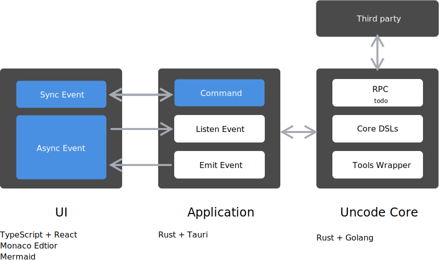

# Uncode CDE（云研发体系开发环境）

Uncode is a **conceptual IDE** designed for the cloud development. Features:

 - Process as DSL
 - Everything as code, code as file.
 - IDE define process.

In this IDE, you can: manage Story, Story to Design (Architecture + UI), Design to Code, Code connect to Design, Zen Coding, development as Production.

(Chinese Introduction)

Uncode 是一个面向云研发时代设计的下一代概念性 IDE。特性：

 - 流程化为领域语言。Process as code
 - 一切皆文件。万物代码化
 - 开发环境即流程。

简单来说，你可以在这个 IDE 上完成：需求的编写，转换需求为设计，设计关联代码，禅模式编程，开发完即可上线。

## Documents

### Architecture

### Screenshot

### Roadmap

 - MVP 0.1
    - [x] kanban in Uncode
    - [x] design in Uncode
    - [x] coding in Uncode
 - Milestone Workflow
    - [ ] UI designer
    - [ ] code generator
    - [ ] online UML to code
    - [ ] git history for story
 - Milestone 1.0
    - [ ] kanban to coding
    - [ ] zen coding
    - [ ] story to Code
    - [ ] UI as Code

### Tech todo

 - [ ] RPC for uncode <-> src-tauri
 - [ ] language identify

### Setup

1. run `yarn start` in `uncode-ui`
2. run `yarn tauri dev` in root project

### Something about arm64
if your OS based arm64,when you have some trouble with `yarn global add @tauri-apps/cli`,you also can use `cargo` cli to run and build this app,look this:

1. run `cargo install tauri-cli --version ^1.0.0-beta` and `cargo tauri --version`
2. run `yarn start` in `uncode-ui`
3. run `cargo tauri dev`in root project

## Documents

License
---

@ 2020~2021 This code is distributed under the MIT license. See `LICENSE` in this directory.
