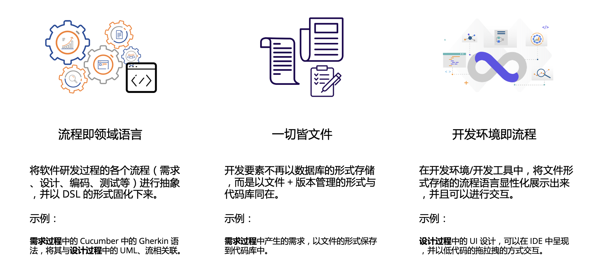
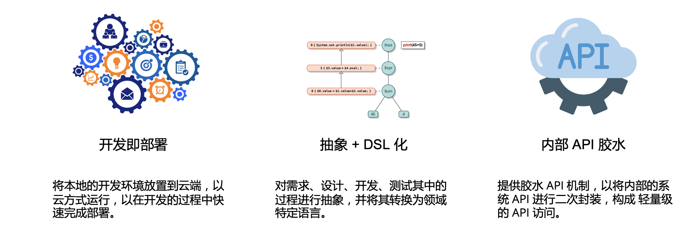

# Uncode CDE（云研发体系开发环境）

Uncode 是一个面向云研发时代设计的下一代概念性 IDE。特性：

 - 流程化为领域语言。Process as code
 - 一切皆文件。万物代码化
 - 开发环境即流程。

简单来说，你可以在这个 IDE 上完成：需求的编写，转换需求为设计，设计关联代码，禅模式编程，开发完即可上线。

基础要素：

1. 开发即部署。即 local dev 便是 dev server，可直接接入现有的系统。
2. 万物即 DSL。具备一定等级的程序语言设计能力。
3. API 的 API。即将现有的内部、外部 API 进行抽象化设计，以提供快速可用的 API。

架构设计：

 - 模块化。
 - 管理和过滤器。主要进行领域特定语言的设计
 - 搭档模式（sidecar）。将诸如语言解析等独立为进程，通过进程调用来实现跨平台
 - 容器桥。将 UI 展示与逻辑相隔离，让 IDE 的大部分组件与 UI 无关。

技术选型：

1. **使用 Rust 来作为主要开发语言**
2. 在 UI 展示上，暂时使用 Tauri（WebView 容器） + React 来展示需求（本地看板）与设计（建模等）。
3. 使用 TypeScript 作为 UI 部分开发语言
4. 使用 RPC 作为与多个 DSL 的通信协议
5. ……

Todo:

 - [ ] multiple webview
 - [ ] DSL for features
 - [ ] distribution apps
 - [ ] GRPC for binary
    - [x] try `tarpc`?
    - [ ] try json rpc ?

## Setup

### Run

1. run `yarn start` in `uncode-ui`
2. run `yarn tauri dev` in root project

### Setup

License
---

@ 2020~2021 This code is distributed under the MIT license. See `LICENSE` in this directory.
